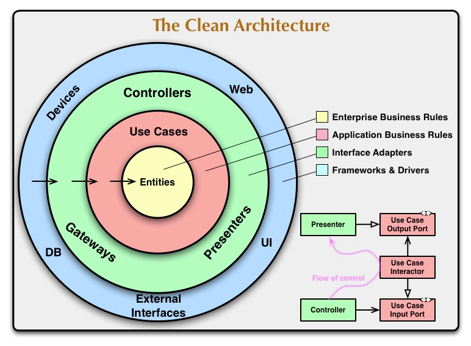

# Order Service
The objective of this service is to take care of the functionalities that involve a order, that is, the creation, listing and updates of each order.

## Prerequisites

Ensure you have the following installed on your local machine:

- Docker
- Java JDK

## Setting Up Your Local Environment

1. **Clone the repository:**
   First, clone the `order-service` repository to your local machine. You can do this by running the following command in your terminal:

    ```bash
    git clone git@github.com:postech-food-challenge/order-service.git
    ```

   Navigate to the project directory:

    ```bash
    cd order-service
    ```

2. **Run application:**
   In order to run the application locally, a few steps need to be performed:

    1. **Run docker-compose script:** In the root folder, run:
       ```bash
        docker compose up -d
        ```
   This command will start both order-service and it's database

That's it! Your local development environment for running order-service is set up, and you should be able to test our application.

## Postman
You can find the collection for this API by clicking the button bellow

[](https://app.getpostman.com/run-collection/11606159-01903bee-9032-43dc-acf5-40c5765df83e?action=collection%2Ffork&source=rip_markdown&collection-url=entityId%3D11606159-01903bee-9032-43dc-acf5-40c5765df83e%26entityType%3Dcollection%26workspaceId%3Da4faf729-13e7-494a-be11-cd3ea2934cce)
## Software Structure
The architecture implemented in our software is the Clean Architecture. Below is a drawing representing this architecture:


## Jacoco Coverage


